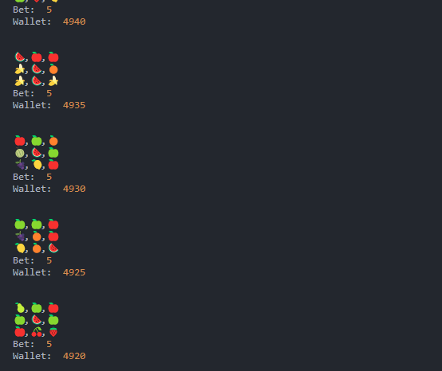

# CLI Slot machine 🎰

Node.js slot machine example

## Description

A basic CLI example about how slot machines work generating RTP and RNG.

### Dependencies

* Node.js
* nodemon
* ts-node
* typescript

### Installing

* npm i
* npm build

### Executing program

* npm run start (production)
* npm run start:dev (development)

## Help

The example is focused on how to use the RTP, RNG in the betting process applied to the player's wallet.

* Three prize lines
* RTP Default 84.3%
* Random numbers range 1-15 (Symbols id)

## Authors

Juan Carballo - jpcbdev@gmail.com

## Version History

[CHANGE LOG](/CHANGELOG.md)

## License

MIT

